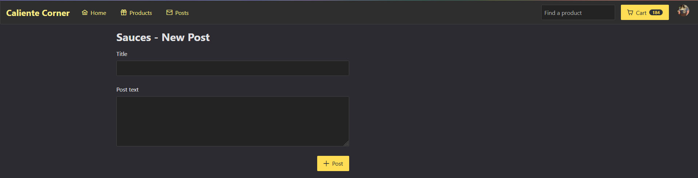

# Caliente Corner
- E-commerce site that sells a variety of delicious hot sauces

# Features
- Product list/view with ratings, reviews, and search
- Order checkout page with shipping options and coupons
- Admin area with management of inventory and users
- Message board
- Custom user system with session management
- Role-based access control
- Custom error page
- And more!

# Tech Stack
- Go, Gin
- Postgres
- React, Typescript, PrimeReact, Redux, Tailwind, RXJS

# Running the application
- Front end: `cd ui/src; npm run dev`
- API run and watch: `air -c .air.toml`

# Screenshots

## Product list

## Product Detail

## Review ratings and charts

## Product Reviews

## Cart

## Order Checkout Page

## Product autocomplete

## Admin - Edit Item

## Message Board

## New Post

## Error page
This page demonstrates use of [error boundaries](https://react.dev/reference/react/Component#catching-rendering-errors-with-an-error-boundary), 
a technique which captures rendering errors and presents users with a more friendly user
experience than a blank page.
